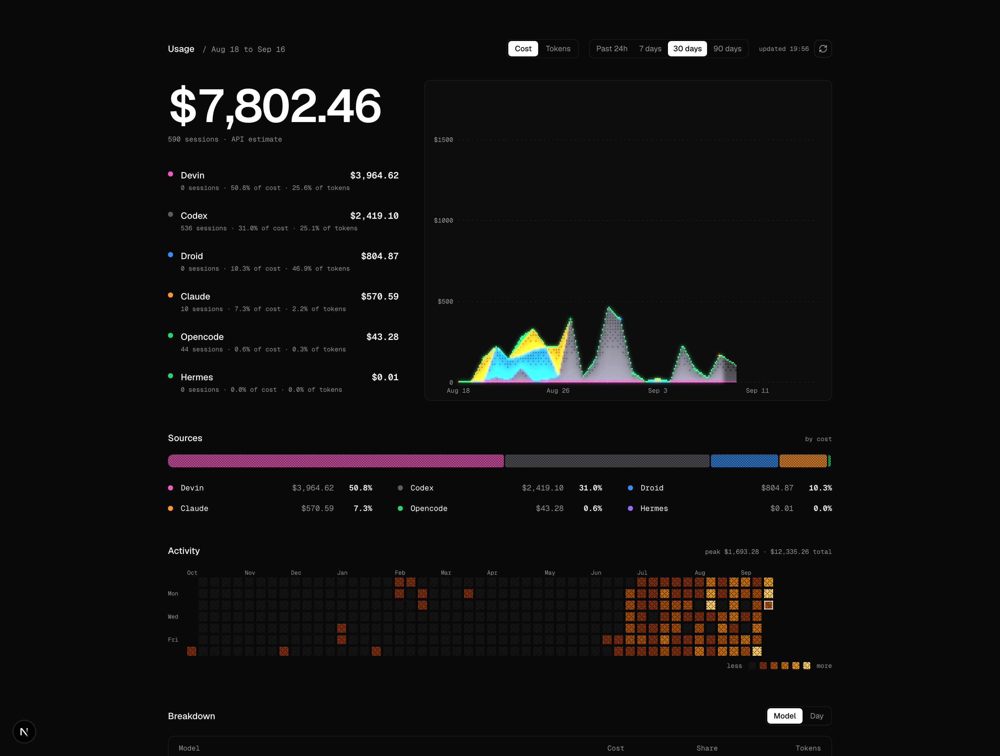
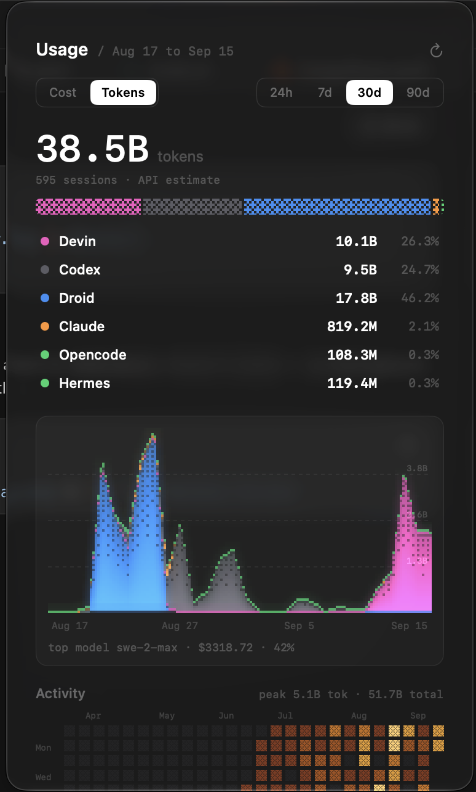

# usage-dash

**One dashboard for all your agent CLI usage.** Aggregates
[ccusage](https://ccusage.com) data from every machine you own over SSH, and
renders it as dithered charts ([dither-kit](https://www.tripwire.sh/dither-kit))
— on the web, and in your menu bar.

<p align="center">
  <br>
  
</p>

- **Multi-machine** — pull usage from any SSH-reachable Mac, Linux, or Windows box
- **Web dashboard** — ranges (24h/7d/30d/90d), agent + model + day breakdowns, activity heatmap
- **UsageBar** — dependency-free SwiftUI menubar app with full dashboard parity
- **Efficient** — demand-driven scans (5-min cache), ~40KB summary endpoint, LAN-only serving

## Setup

```bash
git clone <this-repo> && cd usage-dash
bash scripts/setup.sh      # installs deps, creates config, builds
bun start                  # → http://<your-lan-ip>:3200
```

That's it — zero config needed for a single-machine dashboard. Results cache
in `.data/` for 5 minutes; the refresh button re-scans.

## Add machines

Edit `machines.config.json` (created by setup — gitignored, your topology
never leaves the repo):

```jsonc
{
  "localId": "hub",                       // name for THIS machine's data
  "machines": [
    { "id": "linux-box", "ssh": "me@192.168.1.60" },
    {
      "id": "windows-pc",                 // Windows needs two extras:
      "ssh": "me@192.168.1.50",
      "shell": "powershell",
      "bun": "$env:USERPROFILE\\.bun\\bin\\bunx.exe"
    }
  ]
}
```

Then install your SSH key on each machine (one-time, handles the Windows
`administrators_authorized_keys` quirk automatically):

```bash
bash scripts/authorize.sh
```

Unreachable machines are skipped per scan — nothing ever fails hard. Add
`"key": "~/.ssh/some_key"` to a machine to use a non-default identity file.

<details>
<summary><b>Machine fields</b></summary>

| field | default | meaning |
|---|---|---|
| `id` | — | source tag shown in the dashboard |
| `ssh` | — | `user@host` or a `~/.ssh/config` alias |
| `shell` | `posix` | `posix` or `powershell` |
| `mode` | `ccusage` | `ccusage` = raw scan; `envelope` = run this repo's fetch there and merge its output (includes that machine's devin data) |
| `bun` | `bunx` | remote bunx path (Windows needs it) |
| `repo` | — | for `envelope` mode: where this repo lives on that machine |
| `key` | — | `ssh -i` identity file |

</details>

## Keep it running

On an always-on Mac (a Mac Mini is ideal):

```bash
bash scripts/install-service.sh    # launchd agent: start at login, restart on crash
```

Binds to the LAN interface only — no Tailscale, no loopback listener, nothing
exposed beyond your network. `PORT` and `LABEL` env vars override the defaults
(`3200`, `local.usage-dash`).

## Menubar app

On the Mac you'll monitor from:

```bash
bash menubar/build.sh    # → ~/Applications/UsageBar.app, launches at login
```

Open Settings (gear icon) and set your hub URL, e.g. `http://192.168.1.10:3200`.
Polls a ~40KB summary every 60s, backs off on failures and under Low Power
Mode — measures **0.0% CPU / ~55MB** idle. `BUNDLE_ID` env customizes the app id.

## Privacy

`machines.config.json` and `.data/` are gitignored. Nothing leaves your LAN;
SSH auth is always your own key. Costs are ccusage's API estimates from local
JSONL transcripts.

## License

MIT — see [LICENSE](LICENSE).